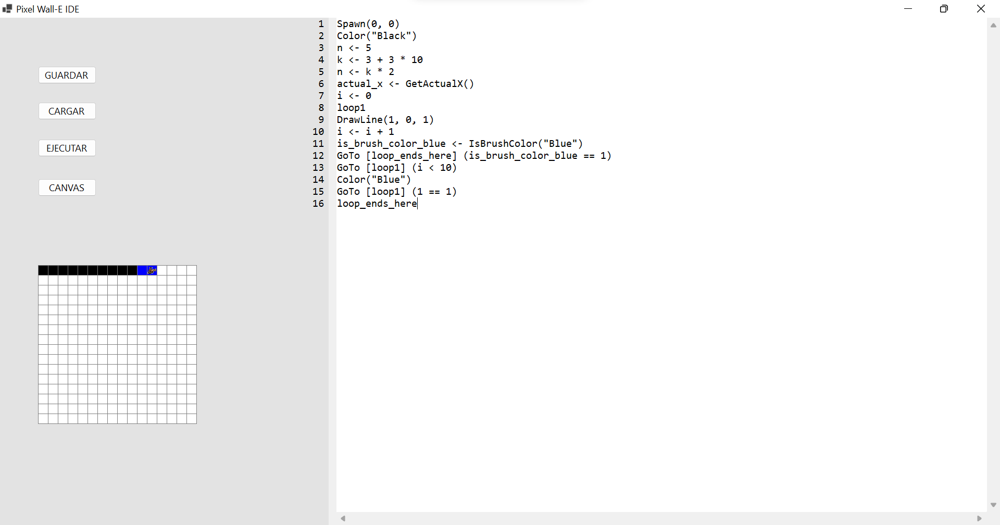
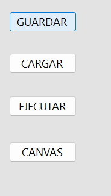

# Proyecto de Programación I. Pixel Wall-E
**Ignacio Miguel Rodríguez Pacheco C121**

**Pixel Wall-E** es un entorno visual e interactivo que interpreta un lenguaje de comandos personalizado para controlar un robot virtual (Wall-E) en un lienzo de píxeles. El proyecto fue desarrollado en **Windows Forms** y permite al usuario escribir código para generar dibujos, cambiar colores, establecer condiciones y realizar control de flujo (como bucles) utilizando instrucciones simples en un lenguaje similar a pseudocódigo.

---

## 🕹️ Instrucciones para usar Pixel Wall-E:

1. Ejecutar el proyecto desde Visual Studio o mediante el comando `dotnet run` desde la carpeta principal del proyecto.
2. Se abrirá una ventana con un editor de texto, un área de dibujo (canvas) y botones para ejecutar y cargar código.
3. Escribir instrucciones en el editor siguiendo la sintaxis del lenguaje Pixel Wall-E (ver ejemplos abajo).
4. Presionar el botón **"Ejecutar"** para compilar e interpretar el código.
5. El resultado será visible en el **canvas**, donde cada píxel representa una acción gráfica de Wall-E.
6. Se puede cambiar el tamaño del lienzo, limpiar el área o volver a cargar archivos `.pw` desde el mismo entorno.

---

## 🧠 Comandos e instrucciones disponibles:

- `Spawn(x, y)`: posiciona a Wall-E en las coordenadas `(x, y)` del canvas.
- `Color("NombreColor")`: cambia el color actual del lápiz. Ejemplo: `"Red"`, `"Blue"`, `"Green"`.
- `Size(n)`: redimensiona el lienzo a `n x n` píxeles.
- `DrawLine(dx, dy, dist)`: dibuja una línea desde la posición actual en la dirección `(dx, dy)` y con longitud `dist`.
- `DrawCircle(dx, dy, radius)`: dibuja un círculo desplazado desde la posición actual.
- `DrawRectangle(dx, dy, dist, width, height)`: dibuja un rectángulo a partir de un desplazamiento y tamaño.
- `Fill()`: realiza un relleno de área (flood fill) a partir de la posición actual.
- `x <- 3`: asignación de variables (puede ser numérica o booleana).
- `Label nombre`: define una etiqueta de salto.
- `GoTo[etiqueta](condición)`: realiza un salto a una etiqueta si se cumple la condición.

---

## 🔁 Control de flujo y variables:

El lenguaje permite manejar **condiciones** y **saltos**, simulando estructuras de control como bucles `while`:

```pw
n <- 5
Label inicio
DrawLine(1, 0, 2)
n <- n - 1
GoTo[inicio](n != 0)
```

Este fragmento dibuja una línea cinco veces desplazándose horizontalmente.

---

## 🖥️ Sobre la interfaz:

- El editor de código admite scroll, zoom con Ctrl+Rueda:



- El lienzo es un área de dibujo pixelado. Al hacer clic sobre él, se puede abrir una vista ampliada:


- El botón para redimensionar el canvas permite elegir nuevos tamaños:




---

## ⚙️ Sobre el código:

El sistema se basa en:

- Un **Lexer** que convierte el texto en una lista de tokens.
- Un **Parser** que genera un AST (árbol de sintaxis abstracta) validando la sintaxis.
- Un **Chequeo Semántico** para asegurar que las variables y etiquetas estén bien definidas.
- Un **Visitor/Interpreter** que recorre el AST y ejecuta los comandos sobre un objeto `CanvasData`.

Las clases principales incluyen:

- `Token`, `TokenType`: para representar y clasificar los elementos del lenguaje.
- `ASTNode` y derivados como `DrawLineStmt`, `GoTo`, `AssignmentStmt`.
- `SemanticContext`: asegura consistencia del programa antes de ejecutarlo.
- `ProgramRunner`: ejecuta el AST y maneja el flujo de control, incluyendo `GoTo`.

